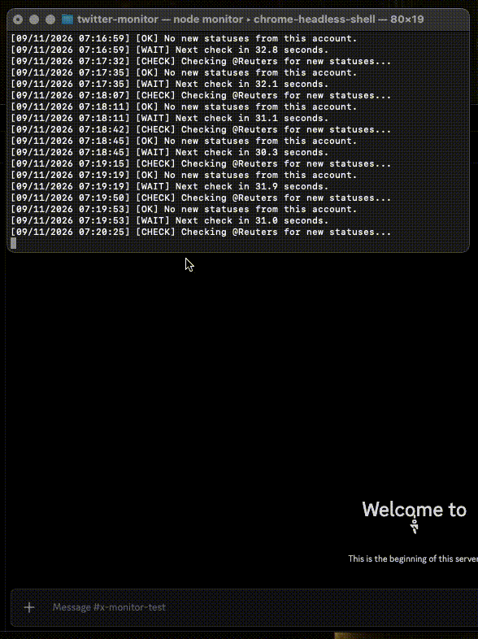
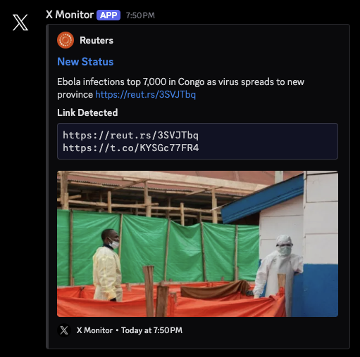

# X Monitor

A lightweight Node.js script that watches an X (formerly Twitter) account for new posts and sends formatted alerts to Discord via webhook.

This was one of the first real programs I built, and it's where a lot of my automation fundamentals came from JavaScript, Node.js, browser automation, DOM scraping, and webhook integrations. I later went back and refactored it to work with the current X site, cleaned up the monitoring logic, and upgraded the Discord output to support richer embeds with images and link previews.

## Demo



**Discord webhook output:**



## Features

- Monitors a configured X account for new posts
- Sends new posts to Discord via webhook, preserving text, links, emojis, timestamps, and author info
- Renders post images and link-preview images inside Discord embeds
- Detects external links included in posts
- Tracks the last processed post to avoid duplicate notifications
- Optional startup notification
- Randomized polling jitter to avoid predictable request timing
- Automatic retries on Discord rate limits or server errors
- Periodic browser page recycling to keep long-running sessions stable
- Graceful shutdown on `SIGINT` / `SIGTERM`

## How It Works

The script uses Playwright to open the monitored account's timeline in headless Chromium, loading authentication cookies from environment variables so it can view the timeline while logged in.

On each polling cycle:

1. Loads the account timeline
2. Extracts visible posts from the DOM
3. Filters out pinned posts and invalid entries
4. Compares the newest posts against the last saved post ID
5. Sends any newly detected posts to Discord
6. Saves the latest processed post ID locally
7. Waits for the configured delay (plus jitter) before checking again

## Tech Stack

`JavaScript` · `Node.js` · `Playwright` · `Chromium` · `Discord Webhooks` · `dotenv`

## Setup

**1. Clone the repo**

```bash
git clone <your-repository-url>
cd x-monitor
```

**2. Install dependencies**

```bash
npm install
```

**3. Install Playwright's Chromium build**

```bash
npx playwright install chromium
```

**4. Configure environment variables**

Create a `.env` file in the project root:

```env
# X account to monitor (no @ symbol)
TWITTER_USERNAME=username

# Discord webhook URL for notifications
# Create one under Server Settings -> Integrations -> Webhooks
DISCORD_WEBHOOK_URL=

# X auth cookies, used by Playwright to view the account while logged in.
# To find these: log into x.com -> DevTools -> Application -> Cookies -> https://x.com
# then copy the "auth_token" and "ct0" values.
TWITTER_AUTH_TOKEN=
TWITTER_CT0=

# Base delay between checks, in ms (recommended: 10000-30000, minimum: 5000)
# A random delay of up to 3s is added automatically on top of this.
MONITOR_DELAY=30000

# Whether to send the latest post to Discord on startup, or just use it
# as the starting point without notifying.
NOTIFY_ON_STARTUP=true
```

> Keep `.env` private — it holds your Discord webhook URL and X auth cookies and should never be committed.

**5. Run it**

```bash
npm start
# or
node monitor.js
```

The monitor runs until stopped with `Ctrl+C` or another shutdown signal.

Add this to `package.json` if it isn't there already:

```json
{
  "scripts": {
    "start": "node monitor.js"
  }
}
```

## Project Structure

```text
x-monitor/
├── assets/
│   ├── demo.gif
│   └── webhook.png
├── monitor.js
├── package.json
├── package-lock.json
├── .env.example
├── .gitignore
└── README.md
```

`lastStatus.json` is generated at runtime to track the last processed post, so it's gitignored rather than committed. A minimal `.gitignore`:

```gitignore
node_modules/
.env
lastStatus.json
```

## What I'd Do Differently Today

This project reflects an earlier stage of my development, so there's a fair amount I'd approach differently now:

- **Multiple account support** — monitor several accounts from one process instead of a single configured username
- **Proxy support** — route sessions/requests through configurable proxies
- **Request-based monitoring** — replace most of the browser automation with direct HTTP requests where possible, for speed and reliability
- **A simple UI** — a small dashboard for managing accounts, webhooks, and logs
- **Structured config** — move settings into a proper config file or database instead of `.env`
- **Tests** — for DOM parsing, link extraction, webhook payloads, and state handling

The biggest lesson from later projects: direct requests are almost always better than full browser automation when you can get the same data without rendering a page. Browser automation earns its keep when auth, dynamic rendering, or anti-bot measures make that impractical.

## Background

I originally built this back when the platform was still called Twitter — browser automation to scrape a timeline and watch for new posts, then push a Discord notification when something new showed up. It was my first serious attempt at automation and one of the projects that got me into software development in the first place; a lot of my early JS and Node knowledge came directly from building and breaking this.

I revisited it years later to get it working on the modern X site, cleaned up the internals, and improved the Discord output — richer embeds with images, links, author info, and timestamps.

## Disclaimer

Built for educational and personal-learning purposes. X can change its site structure at any time, which may break the DOM selectors this script relies on.